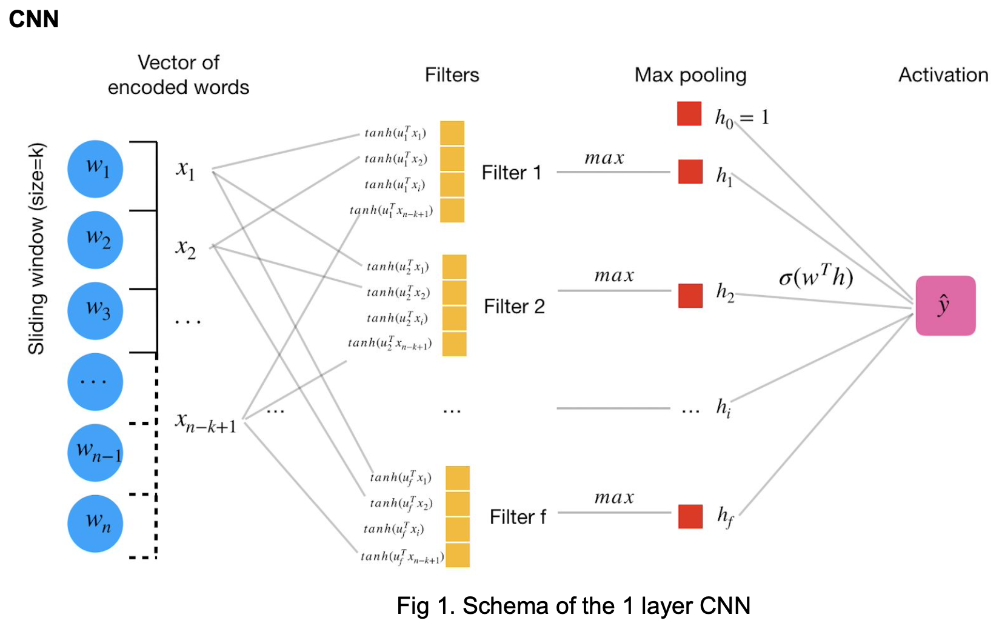

<h1><center>HW2 Convolutional neural networks for text classification
</center></h1>
<h2><center>Due: March 2020 13th, 23:59</center></h2>

In this homework you will learn how to build a simple convolutional neural networks (1 convolution layer with max pooling + 1 activation layer) from scratch, and use the model to solve text classification problem. As optional, you also have a chance to build real life CNN models using Keras + Tensorflow and use it to challenge the model you build from scratch. 
    
<h3> 1. Math preliminaries </h3>

Please answer all these questions:
    
1. What is the form of sigmoid function $σ(z)$ ? Show that $σ′(z) = σ(z)[1 − σ(z)]$.

$$
  \sigma(z)=\frac{1}{1 + e^{-x}} \\
  \sigma'(x) = -\frac{1}{(1+e^{-x})^2} \times(-e^{-x}) \\
  = \frac{1}{1+e^{-x}} \times \frac{e^{-x}}{1+e^{-x}} \\ 
  = \sigma(z)[1-\sigma(z)]
$$

2. Another popular activation function is $tanh(z) = \frac{e^z-e^{-z}}{e^z+e^{-z}}$ , show that $tanh′(z) = 1 − tanh(z)^2$.

$$
tanh(z)=\frac{e^z-e^{-z}}{e^z+e^{-z}}=1-\frac{2}{e^{2x}+1} \\
tanh'(z)=\frac{4e^{2x}}{(e^{2x}+1)^2}=\frac{4}{e^{2x}+1}-\frac{4}{(e^{2x}+1)^2}\\
=1 − tanh(z)^2
$$

3. For a single variable single layer perceptron with sigmoid activation function (equivalent

to LR) and loss function defined as:

$$
\hat{y}_i = σ(w_1x_i+w_0)\\
L(w_0, w_1) = \sum_i y_i lg(\hat{y}_i)+(1−y_i)lg(1−\hat{y}_i)
$$

​		Show that:

$$
\frac{∂L}{∂w_1} =\sum_i(y_i−\hat{y}_i)x_i\\
\frac{∂L}{∂w_0} =\sum_i(y−\hat{y}_i)
$$


By Q1's conclusion, we have : $σ′(w_1x_i+w_0) = σ(w_1x_i+w_0)[1 − σ(w_1x_i+w_0)]x_i$
$$
\frac{∂L}{∂w_1} =\sum_iy_i\frac{1}{\sigma(w_1x_i+w_0)}\sigma(w_1x_i+w_0)(1-\sigma(w_1x_i+w_0))x_i-\\(1-y_i)\frac{1}{\sigma(w_1x_i+w_0)}\sigma(w_1x_i+w_0)(1-\sigma(w_1x_i+w_0))x_i\\=\sum_i y_i(1-\sigma(w_1x_i+w_0))x_i - (1-y_i)\sigma(w_1x_i+w_0)x_i\\
=\sum_ix_iy_i-\sigma(w_1x_i+w_0)x_i=\sum_ix_i(y_i-\hat{y_i})
$$

Similarly:
$$
\frac{∂L}{∂w_0} =\sum_iy_i\frac{1}{\sigma(w_1x_i+w_0)}\sigma(w_1x_i+w_0)(1-\sigma(w_1x_i+w_0))-\\(1-y_i)\frac{1}{\sigma(w_1x_i+w_0)}\sigma(w_1x_i+w_0)(1-\sigma(w_1x_i+w_0))\\=\sum_i y_i(1-\sigma(w_1x_i+w_0)) - (1-y_i)\sigma(w_1x_i+w_0)\\
=\sum_iy_i-\sigma(w_1x_i+w_0)=\sum_i(y_i-\hat{y_i})
$$

4. For column vectors $\vec{x}$ and $\vec{w}$ , and a symmetric matrix $\overleftrightarrow{M}$, define the gradient operator:

$∇_\vec{x} = (\frac{∂}{∂x_0}, \frac{∂}{∂x_1}, ...,\frac{∂}{∂x_n})^T$

show that:

$∇_x(\vec{w}^T\vec{x}) = \vec{w}$
$∇_x(\vec{x}^T\vec{w}) = \vec{w}$
$∇_x(\vec{w}^T\overleftrightarrow{M}\vec{x}) = \overleftrightarrow{M}\vec{w}$


We have $w^Tx=x^Tw$, so the first and second conclusions are same. And for each pair of $x_i$ and $w_i$, we have $\frac{∂}{∂x}=w$. When we take the gradient of linear product, it is same to take gradient for every pair and concate them. So $∇_x(\vec{w}^T\vec{x}) = \vec{w}$ and $∇_x(\vec{x}^T\vec{w}) = \vec{w}$.

For the third, we can take the elemental-wise gradient too, and just take the quadratic way. 


5. Let’s expand Q3 to a more general case. Suppose there is a single layer perceptron with multiple variables:

$\hat{y}_i = σ( \vec{w}^T \vec{x_i} )$
$L(\vec{w}) = \sum_i y_i lg(\hat{y}_i)+(1−y_i)lg(1−\hat{y}_i)$


show that:

$∇_\vec{w}L(\vec{w}) = \sum_i(y_i - \hat{y}_i)\vec{x_i}$

As it is linear for $x_i$, for each pair of $x_i, x_j$, we can think that $x_i$is a variable and other x are constant. so for each $x_i$, $∇_\vec{w}L(\vec{w})=\sum_i(y_i-\hat{y}_i)x_i$. So we have the conclusion:
$$
∇_\vec{w}L(\vec{w}) = \sum_i(y_i - \hat{y}_i)\vec{x_i}
$$

6. In a CNN illustrated as Fig 1, suppose the loss function is:

$L(\overleftrightarrow{U}, \vec{w}) = \sum_i y_i lg(\hat{y}_i)+(1−y_i)lg(1−\hat{y}_i)$

From the conclusion in Q5, we can get that:

$∇_w L(\overleftrightarrow{U}, \vec{w}) = \sum_i (y_i -\hat{y}_i)\vec{h}^{(i)}$


Can you calculate $∇_{u_i} L(U,w)$ using similar techniques?



For each i, we have $w = [w_0,w_1,\cdots,w_f,\cdots,w_F]^T$, thus we have:
$$
(y_ilog(\sigma))^\prime_f=y_i\frac{1}{\sigma}\sigma(1-\sigma)(w^Th)^{\prime}_f=y_i(1-\sigma)w_f(h_f)^\prime_f\\
=y_i(1-\sigma)w_f(max[tanh(u_f^Tx_1),\cdots,tanh(u_f^Tx_{n-k+1})])^\prime_f \\
=y_i(1-\sigma)w_f(tanh_{max})^\prime =y_i(1-\sigma)w_f(1-tanh_{max}^2)\vec{x}_{argmax}
$$
So we can have:
$$
∇_{u_f} L(U,w) = \sum_i(y_i-\sigma)w_f(1-tanh_{max}^2)\vec{x}_{argmax}
$$

<h3> 2. Coding exercise </h3>

Follow the instruction in the notebook, and implement the missing code to build the CNN classifier from scratch. Note that the training might be very slow. Consider reducing the training data size and vocabulary size for testing your code. Ask questions in Piazza if you get blocked.

Hint: In this CNN, words should be one-hot encoded, but we actually numerically encoded it in the code. This is a sparse trick we did to boost the efficiency, try to understand how it works.

Some of the key details you will have a chance to implement:
- Forward propagation of a CNN network
- Backward propagation of a CNN network
- Numerical gradient checking 
- Use Keras and TensorFlow to implement more complex CNN networks
  

You are given the following files:
- `hw02.ipynb`: Notebook file with starter code
- `train.txt`: Training set to train your model
- `test.txt`: Test set to report your model’s performance
- `sample_prediction.csv`: Sample file your prediction result should look like
- `utils/`: folder containing all utility code for the series of homeworks

<h3> 3. Deliverables (zip them all) </h3>

- pdf version of your final notebook.
- Use the best model you trained, generate the prediction for test.txt, name the
output file prediction.csv (Be careful: the best model in your training set might not
be the best model for the test set).
- After you finished the run, does the model perform better than the bag of words
model you built last week? What do you think that contributes to the difference in
performance?
- HW1_writeup.pdf: summarize the method you used and report their performance.
If you worked on the optional task, add the discussion. Add a short essay
discussing the biggest challenges you encounter during this assignment and
what you have learnt.

(**You are encouraged to add the writeup doc into your notebook
using markdown/html langauge, just like how this notes is prepared**)

# =============== Coding Starts Here ===================

```python
%load_ext autoreload
%autoreload 2
%matplotlib inline
import os
import sys
import pandas as pd
import numpy as np
from nltk.stem import WordNetLemmatizer
from nltk import word_tokenize
```

# add utils folder to path
```python
p = os.path.dirname(os.getcwd())
if p not in sys.path:
    sys.path = [p] + sys.path

from utils.hw2 import load_data, save_prediction, read_vocab
from utils.general import sigmoid, tanh, show_keras_model
```


# CNN model 
Complete the code block in the cells in this section.

* step1: Implement the pipeline method to process the raw input
* step2: Implement the forward method
* step3: Implement the backward method
* step4: Run the cell below to train your model


``` python
"""
This cell shows you how the model will be used, you have to finish the cell below before you
can run this cell. 

Once the implementation is done, you should hype tune the parameters to find the best config

Note I only selected 2000 data points to speed up debugging, you should use all the data to train the 
final model
"""

from sklearn.model_selection import train_test_split
data = load_data("train.txt")
vocab = read_vocab("vocab.txt")
X, y = data.text, data.target
X_train, X_dev, y_train, y_dev = train_test_split(X[:2000], y[:2000], test_size=0.3)
cls = CNNTextClassificationModel(vocab)
cls.train(X_train, y_train, X_dev, y_dev, nEpoch=10)

```

```python
import numpy as np

class CNNTextClassificationModel:
    def __init__(self, vocab, window_size=2, F=100, alpha=0.1):
        """
        F: number of filters
        alpha: back propagatoin learning rate
        """
        self.vocab = vocab
        self.window_size = window_size
        self.F = F
        self.alpha = alpha
    # U and w are the weights of the hidden layer, see Fig 1 in the pdf file
    # U is the 1D convolutional layer with shape: voc_size * num_filter * window_size
    self.U = np.random.normal(loc=0, scale=0.01, size=(len(vocab), F, window_size))
    # w is the weights of the activation layer (after max pooling)
    self.w = np.random.normal(loc=0, scale=0.01, size=(F + 1))
    
def pipeline(self, X):
    """
    Data processing pipeline to:
    1. Tokenize, Normalize the raw input
    2. Translate raw data input into numerical encoded vectors
    
    :param X: raw data input
    :return: list of lists
    
    For example:
    X = [["Apples orange banana"]
     ["orange apple bananas"]] 
    returns:
    [[0, 1, 2], 
     [1, 0, 2]]
    """
    
    """
    Implement your code here
    """
    X2 = []
        
    return X2

@staticmethod
def accuracy(probs, labels):
    assert len(probs) == len(labels), "Wrong input!!"
    a = np.array(probs)
    b = np.array(labels)
    
    return 1.0 * (a==b).sum() / len(b) 
      
def train(self, X_train, y_train, X_dev, y_dev, nEpoch=50):
    """
    Function to fit the model
    :param X_train, X_dev: raw data input
    :param y_train, y_dev: label 
    :nEpoch: number of training epoches
    """
    X_train = self.pipeline(X_train)
    X_dev = self.pipeline(X_dev)
    
    for epoch in range(nEpoch):
        self.fit(X_train, y_train)
        
        accuracy_train = self.accuracy(self.predict(X_train), y_train)
        accuracy_dev = self.accuracy(self.predict(X_dev), y_dev)
        
        print("Epoch: {}\tTrain accuracy: {:.3f}\tDev accuracy: {:.3f}"
              .format(epoch, accuracy_train, accuracy_dev))
    
def fit(self, X, y):
    """
    :param X: numerical encoded input
    """
    for (data, label) in zip(X, y):
        self.backward(data, label)
    
    return self
    
def predict(self, X):
    """
    :param X: numerical encoded input
    """
    result = []
    for data in X:
        if self.forward(data)["prob"] > 0.5:
            result.append(1)
        else:
            result.append(0)
        
    return result

def forward(self, word_indices):
    """
    :param word_indices: a list of numerically ecoded words
    :return: a result dictionary containing 3 items -
    result['prob']: \hat y in Fig 1.
    result['h']: the hidden layer output after max pooling, h = [h1, ..., hf]
    result['hid']: argmax of F filters, e.g. j of x_j
    e.g. for the ith filter u_i, tanh(word[hid[j], hid[j] + width]*u_i) = h_i
    """

    assert len(word_indices) >= self.window_size, "Input length cannot be shorter than the window size"
    
    h = np.zeros(self.F + 1, dtype=float)
    hid = np.zeros(self.F, dtype=int)
    prob = 0.0

    # layer 1. compute h and hid
    # loop through the input data of word indices and
    # keep track of the max filtered value h_i and its position index x_j
    # h_i = max(tanh(weighted sum of all words in a given window)) over all windows for u_i
    """
    Implement your code here
    """
        
    # layer 2. compute probability
    # once h and hid are computed, compute the probabiliy by sigmoid(h^TV)
    """
    Implement your code here
    """

    # return result
    return {"prob": prob, "h": h, "hid": hid}

def backward(self, word_indices, label):
    """
    Update the U, w using backward propagation
    
    :param word_indices: a list of numerically ecoded words
    :param label: int 0 or 1
    :return: None
    
    update weight matrix/vector U and V based on the loss function
    """
    
    pred = self.forward(word_indices)
    prob = pred["prob"]
    h = pred["h"]
    hid = pred["hid"]

    # update U and w here
    # to update V: w_new = w_current + d(loss_function)/d(w)*alpha
    # to update U: U_new = U_current + d(loss_function)/d(U)*alpha
    # Hint: use Q6 in the first part of your homework
    """
    Implement your code here
    """

def calc_gradients_w(self, pred, y):
    return (y - pred['prob']) * pred['h']
```

# Optional: Build your model using Keras + Tensorflow

So far we have always forced you to implement things from scratch. You may feel it's overwhelming, but fortunately, it is not how the real world works. In the real world, there are existing tools you can leverage, so you can focus on the most innovative part of your work. We asked you to do all the previous execises for learning purpose, and since you have already reached so far, it's time to unleash yourself and allow you the access to the real world toolings.

## Sample model 

First let's see how you can build a similar CNN model you just had using Keras

```python
from sklearn.pipeline import Pipeline
from sklearn.preprocessing import OneHotEncoder

MAX_LENGTH = 100
```

Yes! it is a good practice to do data processing outside the ML model

```python
wnet = WordNetLemmatizer()
```

Numerical encode all the words

```python
unknown = vocab['__unknown__']
X_train2 = [[vocab.get(wnet.lemmatize(w), unknown) for w in word_tokenize(sent)] for sent in X_train]
X_dev2 = [[vocab.get(wnet.lemmatize(w), unknown)for w in word_tokenize(sent)] for sent in X_dev]
```


Tensorflow does not handle variable length input well, let's unify all input to the same length

```python
def trim_X(X, max_length=100, default=vocab['.']):
    for i in range(len(X)):
        if len(X[i]) > max_length:
            X[i] = X[i][:max_length]
        elif len(X[i]) < max_length:
            X[i] = X[i] + [default] * (max_length - len(X[i]))
return np.array(X)
X_train2 = trim_X(X_train2, MAX_LENGTH)
X_dev2 = trim_X(X_dev2, MAX_LENGTH)
```


Now we have all the input data nicely encoded with numerical label, and each of the input data are trimmed to have the same length. We would have needed to further apply one-hot encode for each word. However, this would be very expensive, since each word will be expanded into a len(vocab) (~10000) length vector. Keras does not support sparse matrix input at this moment. But don't worry, we will use an advanced technique called embedding layer. This concept will be introduced in the next lesson. At this moment, you don't have to understand why.

```python
from keras.models import Sequential
from keras.layers import Embedding, Conv1D, MaxPooling1D, Dense, GlobalMaxPooling1D

model = Sequential()
model.add(Embedding(input_dim=len(vocab), input_length=MAX_LENGTH, output_dim=1024, name="Embedding-1"))
model.add(Conv1D(filters=100, kernel_size=2, activation="tanh", name="Conv1D-1"))
model.add(GlobalMaxPooling1D(name="MaxPooling1D-1"))
model.add(Dense(1, activation="sigmoid", name="Dense-1"))
print(model.summary())

show_keras_model(model)
```


# Train the model
```python
model.compile(loss="binary_crossentropy", optimizer='adam', metrics=['accuracy'])
model.fit(X_train2, y_train, epochs=10, validation_data=[X_dev2, y_dev])
```

## Play with your own model

We have shown you have to use an industry level tool to build a CNN model. Hopefully you think it is simpler than the version we built from scratch. Not really? Read Keras Documentation and learn more: https://keras.io/ 

### Now it's your turn to build some more complicated CNN models

"""
Implement your code here
"""